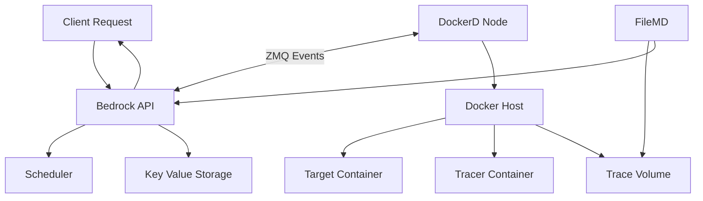
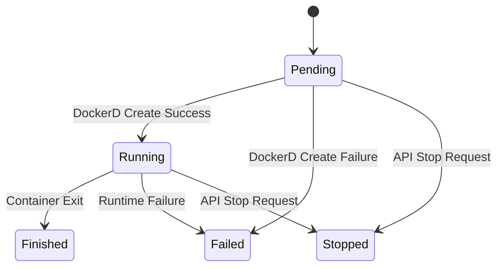

# Bedrock API


**Bedrock API** is an HTTP service that coordinates **Bedrock tracing workloads** through REST APIs and internal event-driven communication.

It is responsible for:

* session lifecycle management
* distributed container orchestration through daemons
* trace log collection
* centralized state management

## Architecture Overview

The system consists of four main components.

* API Server
* Docker Daemon
* File Manager Daemon
* Key-Value Storage

### Components

#### API

The API is the central coordinator of the platform.

Responsibilities:

* exposes RESTful endpoints
* owns the system state
* manages session lifecycle
* stores session metadata in key-value storage
* assigns DockerD workers using round-robin scheduling

> API is the only component allowed to directly access persistent KV storage.

#### Docker Daemon (DockerD)

DockerD interacts with the host Docker daemon to execute tracing workloads.

Responsibilities:

* polls API through ZMQ
* receives sessions
* creates target containers
* creates tracer containers
* manages Docker volumes
* tracks container execution state
* reports state changes back to API

DockerD maps resources using a `session-id`.

#### File Manager Daemon (FileMD)

FileMD transfers trace artifacts from DockerD hosts back to the API host.

Responsibilities:

* monitors Docker volumes
* waits until volumes are unlocked
* uploads trace logs
* removes uploaded artifacts

#### Key-Value Storage

Persistent storage used by API for system state.

Stores:

* sessions
* status

### System Flow

#### High-Level Lifecycle

1. API receives a session creation/update requests
2. API assigns a DockerD to new sessions
3. API stores sessions in KV storage
4. DockerD pulls its sessions through ZMQ using a unique id
5. DockerD starts containers
6. DockerD reports updates during pulls
7. FileMD monitors the tracing volumes
8. FileMD uploads logs after completion
9. API updates the states using DockerD data

#### Architecture Diagram



### DockerD Logic

DockerD periodically contacts API through ZMQ.

It sends:

* current running sessions
* local container status

API compares:

* DockerD reported state
* persisted KV state

Then API responds with:

* sessions of that DockerD instance

### Session Execution Lifecycle

DockerD receives:

* container image
* command
* timeout (TTL)

Then DockerD:

1. creates a volume
2. locks the volume
3. starts target container
4. starts tracer container
5. monitors lifecycle

A session can terminate because:

* timeout reached
* container exited normally
* container failed
* API requested stop

Cleanup phase:

* remove containers
* unlock volume

After unlock:

* FileMD uploads logs
* FileMD deletes local artifacts

### Data Models

#### Session

```text
Session
├── UUID
├── Request
│   ├── Docker Image
│   ├── Command
│   └── Timeout
├── Status
├── Created At
└── DockerD ID
```

##### Status Values

* Pending: a session that is not sent to DockerD yet
* Running: a session that is sent to its DockerD
* Stopped: a session that is aborted by user
* Finished: a session that is done (container exit/timeout hit)
* Failed: a session that is failed (container exit with non zero)

#### Request State Machine



## API Endpoints

### Create Session

```http
POST /api/sessions
```

Creates:

* new session and assigns a DockerD

### Stop Session

```http
PUT /api/sessions/:id
```

Creates:

* patch event for DockerD

### List Sessions

```http
GET /api/sessions
```

Returns all sessions from KV storage.

### Get Session Logs

```http
GET /api/sessions/:id/logs
```

Returns session tracing logs.

### Store Session Logs

```http
POST /api/sessions/:id/logs
```

Uploads session tracing logs.

## Requirements

* Docker
* Go 1.25
* libzmq3-dev
* libczmq-dev
* libsodium-dev
* pkg-config

## Build & Run

```sh
make build
touch config.yaml
./bedrock api
./bedrock dockerd
```

## Related Projects

* GitHub repository: **Bedrock Tracer**
  [https://github.com/amirhnajafiz/bedrock-tracer](https://github.com/amirhnajafiz/bedrock-tracer)

## Libraries

* [Echo](https://github.com/labstack/echo)
* [Docker Go SDK](https://github.com/docker/go-sdk)
* [ZeroMQ (`go-zeromq/zmq4`)](https://github.com/go-zeromq/zmq4)
* [gocache](https://github.com/eko/gocache)
